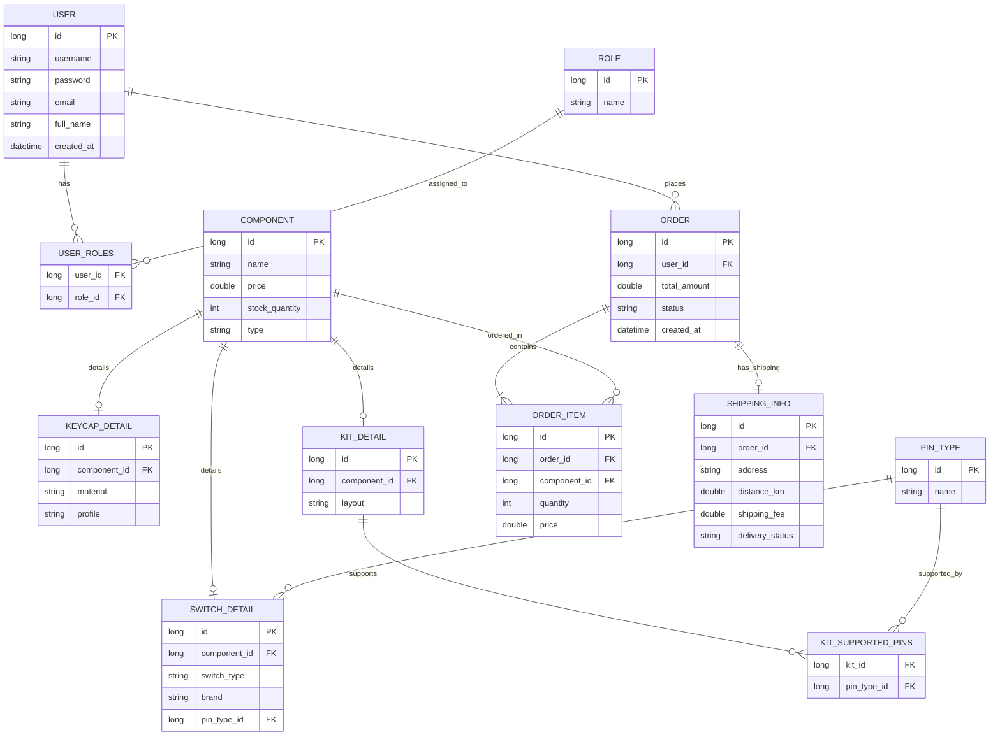

# BÁO CÁO HACKATHON: TÁI CẤU TRÚC HỆ THỐNG & THIẾT KẾ HỆ THỐNG KEEBMASTER

- **Họ và tên sinh viên**: Phùng Văn Vương
- **Mã sinh viên**: 009
- **Lớp**: HN-K24-CNTT1
- **Mã đề**: DE009

---

## 1. MỤC TIÊU KỸ THUẬT (TECHNICAL GOALS)

Trong dự án này, các giải pháp công nghệ và kiến trúc sau đây đã được áp dụng để giải quyết các vấn đề nghiệp vụ:
1. **Tái cấu trúc OOP & Design Pattern (Phần 1)**:
   - Áp dụng **Strategy Design Pattern** kết hợp với cơ chế **Registry (sử dụng Map)** để thay thế toàn bộ cấu trúc điều hướng `if-else` phức tạp trong việc tính toán chi phí modding bàn phím.
   - Giúp tách biệt logic xử lý của từng dịch vụ modding thành các lớp độc lập (`LubeSwitchStrategy`, `TapeModStrategy`, v.v.). Khi có yêu cầu thêm dịch vụ mới như `WIRE_BALANCING`, ta chỉ cần tạo một lớp mới và đăng ký nó vào hệ thống mà hoàn toàn không cần can thiệp hay sửa đổi mã nguồn cốt lõi của `KeyboardModdingService`. Điều này tuân thủ nghiêm ngặt nguyên lý **Open/Closed Principle (OCP)**.
2. **Quản lý Giao dịch & Đảm bảo Tính toàn vẹn Dữ liệu (Phần 2)**:
   - Cấu hình lại cơ chế rollback của Spring Boot `@Transactional` bằng cách khai báo rõ thuộc tính `rollbackFor = {IOException.class, Exception.class}`.
   - Giải quyết triệt để lỗi mất tính toàn vẹn dữ liệu khi hệ thống gặp **Checked Exception** (cụ thể là `IOException` khi ghi hóa đơn PDF thất bại). Cơ chế này đảm bảo database MySQL sẽ tự động Rollback giao dịch, ngăn chặn tình trạng đơn hàng ảo (rác dữ liệu) xuất hiện trong hệ thống.
3. **Phân tích & Thiết kế Cơ sở Dữ liệu chuẩn hóa (Phần 3)**:
   - Thiết kế cơ sở dữ liệu quan hệ cho nền tảng **KeebMaster** đáp ứng các dạng chuẩn hóa (1NF, 2NF, 3NF), loại bỏ hoàn toàn việc lưu trữ mảng/chuỗi đa trị cho các thuộc tính tương thích (như chân cắm 3-pin/5-pin của Kit và Switch) bằng cách tách thành các mối quan hệ **1-N** và **N-N** (`PIN_TYPE`, `KIT_SUPPORTED_PINS`).
   - Tối ưu hóa hiệu năng tính toán doanh thu trên tầng Service bằng cách sử dụng **Java Stream API** (`Collectors.groupingBy` và `summingDouble`) thay vì các vòng lặp truyền thống.

---

## 2. LỊCH SỬ PROMPT (PROMPT CHAIN)

Dưới đây là chuỗi các câu lệnh (prompts) đã sử dụng để làm việc cùng trợ lý AI để giải quyết từng phần của bài làm:

### Phần 1: Tái cấu trúc OCP với Strategy Pattern
* **Prompt 1**: 
  > "Tôi có một class `KeyboardModdingService` tính toán chi phí mod bàn phím cơ bằng cách duyệt qua danh sách dịch vụ và dùng chuỗi `if-else` so khớp chuỗi (ví dụ: `LUBE_SWITCH`, `TAPE_MOD`). Thiết kế này đang vi phạm nguyên tắc Open/Closed Principle (OCP) vì mỗi khi thêm dịch vụ mới như `WIRE_BALANCING`, tôi lại phải sửa code của service này. Bạn hãy hướng dẫn tôi áp dụng Strategy Pattern để giải quyết triệt để vấn đề này."
* **Prompt 2**:
  > "Phân tích rất hợp lý. Bây giờ hãy viết cho tôi các class Java cụ thể bao gồm: `ModService`, `KeyboardOrder`, `Quotation`, interface `ModStrategy` và các class triển khai cụ thể: `LubeSwitchStrategy`, `TapeModStrategy`, `CaseFoamStrategy`, `SolderingStrategy`."
* **Prompt 3**:
  > "Làm thế nào để `KeyboardModdingService` có thể tự động tìm kiếm và thực thi đúng strategy dựa trên trường `type` của dịch vụ mà không cần dùng `if-else` hay `switch-case` trong vòng lặp? Hãy tạo một Map registry trong service và viết thêm phương thức `registerStrategy` để đăng ký động. Viết luôn class `WireBalancingStrategy` (dịch vụ mới) và một class `ModdingDemo` có hàm `main` để kiểm chứng việc thêm dịch vụ mới hoạt động mà không cần sửa code cũ."

### Phần 2: Debugging @Transactional với Checked Exception
* **Prompt 1**:
  > "Trong Spring Boot, tôi có một service `KeyboardOrderService` dùng annotation `@Transactional`. Phương thức `placeOrder` thực hiện lưu đơn hàng vào MySQL qua Spring Data JPA, sau đó gọi hàm `generateInvoicePdf` để ghi file PDF xuống ổ cứng. Khi hàm ghi file ném ra `IOException`, tiến trình bị dừng nhưng dữ liệu đơn hàng vẫn được lưu vào MySQL (không rollback). Tại sao lại có hiện tượng này? Hãy giải thích rõ cơ chế mặc định của Spring đối với Checked và Unchecked Exception."
* **Prompt 2**:
  > "À, ra là Spring mặc định chỉ rollback khi gặp Unchecked Exception (RuntimeException và Error), còn với Checked Exception như IOException thì không. Hãy hướng dẫn tôi cách cấu hình lại `@Transactional` để bắt buộc rollback khi xảy ra `IOException` hoặc bất kỳ ngoại lệ nào khác. Hãy viết lại code của `KeyboardOrderService` sau khi sửa."

### Phần 3: Phân tích và thiết kế hệ thống KeebMaster
* **Prompt 1 (Đề xuất Tech Stack)**:
  > "Tôi đang chuẩn bị xây dựng dự án 'KeebMaster Platform' - một ứng dụng thương mại điện tử và cộng đồng phím cơ dạng Monolithic Java Web. Các nghiệp vụ chính gồm: Quản lý người dùng (3 role: Builder, Modder, Admin), quản lý kho linh kiện (switch, keycap, kit phím), thống kê doanh thu linh kiện nhóm theo loại Switch bằng Java Stream API, và gọi API vận chuyển hỏa tốc của đối tác logistics. Hãy đề xuất một Tech Stack chi tiết và lý do lựa chọn thuyết phục nhất cho khách hàng."
* **Prompt 2 (Phân tích Thực thể)**:
  > "Dựa trên nghiệp vụ của KeebMaster, hãy phân tích các thực thể (Entities) cần thiết để thiết kế database. Lưu ý đặc biệt: Với tính năng tương thích (ví dụ Kit hỗ trợ switch 3-pin hay 5-pin, layout nào), tuyệt đối không dùng kiểu mảng hoặc chuỗi phân tách bằng dấu phẩy trong một cột duy nhất. Hãy thiết kế chuẩn hóa quan hệ 1-N hoặc N-N rõ ràng. Liệt kê chi tiết các thuộc tính của từng thực thể."
* **Prompt 3 (Thiết kế ERD)**:
  > "Từ danh sách thực thể đã phân tích ở trên, hãy tạo mã Mermaid để vẽ sơ đồ quan hệ thực thể (ERD) chi tiết, thể hiện rõ các khóa chính (PK), khóa ngoại (FK) và mối quan hệ giữa các bảng."

---

## 3. PHÂN TÍCH LỖI AI (AI ERROR ANALYSIS)

### Điểm AI làm chưa tối ưu ở lần sinh code đầu tiên:
Khi yêu cầu áp dụng Strategy Pattern ở lần đầu tiên, AI đã đề xuất cấu trúc interface `ModStrategy` và các class con rất tốt. Tuy nhiên, trong class `KeyboardModdingService`, AI lại viết như sau để khởi tạo Strategy:
```java
public double calculate(ModService mod) {
    ModStrategy strategy;
    switch(mod.getType()) {
        case "LUBE_SWITCH":
            strategy = new LubeSwitchStrategy();
            break;
        case "TAPE_MOD":
            strategy = new TapeModStrategy();
            break;
        // ...
        default:
            throw new RuntimeException("Chưa hỗ trợ");
    }
    return strategy.calculate(mod);
}
```

### Phân tích lỗi:
Cách làm này của AI **chưa tối ưu** và **vẫn vi phạm nguyên lý Open/Closed Principle (OCP)**. Khi xưởng mod thêm dịch vụ mới như `WIRE_BALANCING`, lập trình viên vẫn buộc phải mở file `KeyboardModdingService.java` ra để viết thêm một nhánh `case "WIRE_BALANCING"` vào cấu trúc `switch-case`. Việc phải sửa đổi trực tiếp vào lớp cốt lõi này có thể dẫn đến rủi ro làm hỏng các logic cũ đang chạy ổn định.

### Cách khắc phục:
Sinh viên đã yêu cầu AI thiết kế lại bằng cách sử dụng một **Registry** dựa trên `Map<String, ModStrategy>`. 
- Toàn bộ các dịch vụ mặc định được đưa vào Map khi khởi tạo Service.
- Cung cấp phương thức public `registerStrategy(String type, ModStrategy strategy)` để đăng ký thêm dịch vụ mới từ bên ngoài.
- Vòng lặp tính toán chi phí chỉ đơn giản là thực hiện lookup từ Map: `ModStrategy strategy = strategies.get(type)`. 
Nhờ vậy, khi thêm dịch vụ `WIRE_BALANCING`, ta hoàn toàn không cần chạm vào file `KeyboardModdingService.java`, mà chỉ cần viết class `WireBalancingStrategy` và gọi `registerStrategy` ở hàm cấu hình/chạy ứng dụng.

---

## PHẦN 1: TÁI CẤU TRÚC HỆ THỐNG ĐỂ DỄ MỞ RỘNG

Toàn bộ mã nguồn xử lý tính toán chi phí dịch vụ modding bàn phím cơ đã được tái cấu trúc thành công tại thư mục `src/modding`.

### Sơ đồ lớp (Class Diagram) của giải pháp:
- **[ModStrategy.java](file:///d:/IT212/HN-K24-CNTT1_PhungVanVuong_009/src/modding/ModStrategy.java)**: Interface định nghĩa phương thức `calculate(ModService service)`.
- **Các Strategy cụ thể**:
  - [LubeSwitchStrategy.java](file:///d:/IT212/HN-K24-CNTT1_PhungVanVuong_009/src/modding/LubeSwitchStrategy.java): Xử lý tính phí bôi trơn switch (3.000đ/switch).
  - [TapeModStrategy.java](file:///d:/IT212/HN-K24-CNTT1_PhungVanVuong_009/src/modding/TapeModStrategy.java): Xử lý Tempest Tape Mod (50.000đ).
  - [CaseFoamStrategy.java](file:///d:/IT212/HN-K24-CNTT1_PhungVanVuong_009/src/modding/CaseFoamStrategy.java): Xử lý lót Poron foam (100.000đ).
  - [SolderingStrategy.java](file:///d:/IT212/HN-K24-CNTT1_PhungVanVuong_009/src/modding/SolderingStrategy.java): Xử lý hàn mạch (5.000đ/switch).
  - [WireBalancingStrategy.java](file:///d:/IT212/HN-K24-CNTT1_PhungVanVuong_009/src/modding/WireBalancingStrategy.java): Dịch vụ mới được thêm vào độc lập (15.000đ/stabilizer).
- **[KeyboardModdingService.java](file:///d:/IT212/HN-K24-CNTT1_PhungVanVuong_009/src/modding/KeyboardModdingService.java)**: Chứa core loop tính toán chi phí, sử dụng Map Registry để tìm kiếm Strategy thích hợp.

### Đoạn code cốt lõi của KeyboardModdingService sau khi tái cấu trúc:
```java
package modding;

import java.util.HashMap;
import java.util.Map;

public class KeyboardModdingService {
    // Registry chứa các chiến lược tính phí
    private final Map<String, ModStrategy> strategies = new HashMap<>();

    public KeyboardModdingService() {
        // Đăng ký các dịch vụ mod mặc định
        strategies.put("LUBE_SWITCH", new LubeSwitchStrategy());
        strategies.put("TAPE_MOD", new TapeModStrategy());
        strategies.put("CASE_FOAM", new CaseFoamStrategy());
        strategies.put("SOLDERING", new SolderingStrategy());
    }

    /**
     * Cho phép đăng ký thêm dịch vụ mod mới từ bên ngoài (Open/Closed Principle)
     */
    public void registerStrategy(String type, ModStrategy strategy) {
        strategies.put(type, strategy);
    }

    public Quotation calculateModdingCost(KeyboardOrder order) {
        double total = 0;
        System.out.println("Bắt đầu tính toán chi phí custom cho kit: " + order.getKitName());

        for (ModService mod : order.getServices()) {
            String type = mod.getType();
            ModStrategy strategy = strategies.get(type);
            
            if (strategy == null) {
                throw new RuntimeException("Dịch vụ mod này chưa được xưởng hỗ trợ: " + type);
            }
            
            // Tính toán chi phí thông qua Strategy tương ứng
            total += strategy.calculate(mod);
        }

        return new Quotation(order.getId(), total, "DRAFT");
    }
}
```

---

## PHẦN 2: DEBUGGING BẢO MẬT VÀ XỬ LÝ LỖI HỆ THỐNG

### Giải thích nguyên nhân gốc rễ:
Trong cơ chế quản lý giao dịch của Spring Framework, annotation `@Transactional` mặc định hoạt động theo **Default Rollback Policy**:
- **Chỉ tự động Rollback** đối với các **Unchecked Exception** (các ngoại lệ kế thừa từ `RuntimeException`, ví dụ: `NullPointerException`, `IllegalArgumentException`, `ArithmeticException`) và **Error**.
- **Không tự động Rollback** đối với các **Checked Exception** (các ngoại lệ kế thừa trực tiếp từ `Exception` nhưng không thuộc `RuntimeException`, ví dụ: `IOException`, `SQLException`, `ClassNotFoundException`).

Trong đoạn mã nguồn ban đầu:
- Hàm `generateInvoicePdf` ném ra `IOException` (là một **Checked Exception**).
- Khi lỗi xảy ra, Spring bắt được ngoại lệ nhưng do quy tắc mặc định nêu trên, nó coi đây là lỗi nghiệp vụ thông thường không cần khôi phục dữ liệu. Kết quả là transaction vẫn được **Commit**, dẫn đến đơn hàng `newOrder` vẫn được lưu vào MySQL mặc dù file PDF hóa đơn không được tạo ra thành công (gây rác dữ liệu).

### Sự khác biệt giữa Checked Exception và Unchecked Exception:
| Đặc điểm | Checked Exception | Unchecked Exception (RuntimeException) |
| :--- | :--- | :--- |
| **Định nghĩa** | Các ngoại lệ bắt buộc phải được xử lý (try-catch) hoặc khai báo (`throws`) ngay tại thời điểm biên dịch (compile-time). | Các ngoại lệ xảy ra trong quá trình chạy chương trình (runtime), không bắt buộc phải khai báo hay try-catch. |
| **Ví dụ** | `IOException`, `SQLException`, `FileNotFoundException` | `NullPointerException`, `IndexOutOfBoundsException`, `IllegalArgumentException` |
| **Mục đích** | Đại diện cho các sự cố nằm ngoài tầm kiểm soát của chương trình (như lỗi kết nối mạng, đĩa đầy, file không tồn tại). | Đại diện cho lỗi logic trong code của lập trình viên (lỗi lập trình). |
| **Cơ chế Rollback mặc định của Spring** | **KHÔNG** rollback giao dịch. | **CÓ** tự động rollback giao dịch. |

### Giải pháp khắc phục:
Để bắt buộc Spring thực hiện rollback khi xảy ra `IOException` (hoặc bất kỳ ngoại lệ nào), ta cấu hình thuộc tính `rollbackFor` của `@Transactional`:
```java
@Transactional(rollbackFor = {IOException.class, Exception.class})
```
Đoạn code sửa đổi hoàn chỉnh nằm tại [KeyboardOrderService.java](file:///d:/IT212/HN-K24-CNTT1_PhungVanVuong_009/src/checkout/KeyboardOrderService.java).

---

## PHẦN 3: PHÂN TÍCH VÀ THIẾT KẾ HỆ THỐNG KEEBMASTER

### Nhiệm vụ 1: Đề xuất Giải pháp Công nghệ (Tech Stack)

#### Prompt yêu cầu AI:
> "Tôi đang chuẩn bị xây dựng dự án 'KeebMaster Platform' - một ứng dụng thương mại điện tử và cộng đồng phím cơ dạng Monolithic Java Web. Các nghiệp vụ chính gồm: Quản lý người dùng (3 role: Builder, Modder, Admin), quản lý kho linh kiện (switch, keycap, kit phím), thống kê doanh thu linh kiện nhóm theo loại Switch bằng Java Stream API, và gọi API vận chuyển hỏa tốc của đối tác logistics. Hãy đề xuất một Tech Stack chi tiết và lý do lựa chọn thuyết phục nhất cho khách hàng."

#### Tóm tắt giải pháp công nghệ đề xuất:
1. **Backend**:
   - **Spring Boot 3.x (Java 17/21)**: Đóng vai trò là nền tảng cốt lõi của ứng dụng Web Monolith. Tích hợp sẵn Spring MVC, Spring Data JPA, Spring Security.
   - **Java 17/21**: Sử dụng các tính năng hiện đại như Records (định nghĩa DTO/Entity ngắn gọn), Pattern Matching, Virtual Threads (xử lý concurrency hiệu quả) và cải tiến hiệu năng của Stream API.
2. **Database**:
   - **MySQL 8.0**: Hệ quản trị cơ sở dữ liệu quan hệ (RDBMS) mạnh mẽ, đảm bảo tính nhất quán dữ liệu (ACID) cực kỳ quan trọng đối với luồng thanh toán và quản lý kho hàng.
3. **Frontend (Tích hợp trong Monolith)**:
   - **Thymeleaf**: Công cụ template engine mạnh mẽ của Java, giúp dựng giao diện phía server-side nhanh chóng, bảo mật và tích hợp hoàn hảo với Spring Boot.
   - **TailwindCSS**: CSS Framework giúp thiết kế giao diện UI/UX tùy chỉnh, hiện đại, đảm bảo tính thẩm mỹ cao mà không làm phình to file CSS.
   - **Alpine.js**: Thư viện JavaScript siêu nhẹ (siêu việt hơn jQuery) giúp xử lý các tương tác nhỏ, micro-animations, và dynamic UI (hiển thị popup, dropdown) trực tiếp trên trang Thymeleaf mà không cần xây dựng hệ thống SPA phức tạp (như React/Angular).
4. **Giao tiếp Dịch vụ Ngoại vi (Logistics API)**:
   - **Spring WebClient (Reactive Web)**: Sử dụng để thực hiện các cuộc gọi HTTP bất đồng bộ (non-blocking) tới API của đối tác Logistics nhằm tính toán phí ship. Tối ưu hơn hẳn so với `RestTemplate` đã bị Spring hạn chế phát triển.

#### Nhận xét phản biện của lập trình viên:
- **Đồng ý**:
  - Việc lựa chọn **Spring Boot** làm Monolith là hoàn toàn chính xác cho một Startup. Nó giúp giảm thời gian triển khai (Time-to-market), dễ dàng kiểm thử, triển khai gói gọn trong một file `.jar` duy nhất.
  - Sử dụng **Thymeleaf + Alpine.js + TailwindCSS** thay vì tách rời React/Vue giúp loại bỏ hoàn toàn sự phức tạp của việc cấu hình CORS, quản lý State phức tạp ở client, và bảo mật Session/Cookie trở nên đơn giản hơn nhiều nhờ Spring Security.
  - **MySQL** là lựa chọn hợp lý vì dữ liệu thương mại điện tử có tính liên kết chặt chẽ (User - Order - OrderItem - Product).
- **Phản biện / Đề xuất thêm**:
  - Mặc dù là Monolith, hệ thống KeebMaster sẽ có lượng tương tác cộng đồng lớn (Modder đăng bài, chia sẻ kinh nghiệm). Để tối ưu hiệu năng, cần bổ sung **Redis** làm tầng Caching cho các truy vấn danh mục sản phẩm và Switch/Kit phổ biến, cũng như quản lý Session tập trung phòng trường hợp sau này muốn scale-out lên nhiều node.
  - Cần tích hợp thêm **Flyway** hoặc **Liquibase** để quản lý phiên bản Database (Database Migration), tránh việc chỉnh sửa database thủ công bằng tay giữa các môi trường Dev và Production.

---

### Nhiệm vụ 2: Phân tích Thực thể (Entity Analysis)

#### Prompt yêu cầu AI:
> "Dựa trên nghiệp vụ của KeebMaster, hãy phân tích các thực thể (Entities) cần thiết để thiết kế database. Lưu ý đặc biệt: Với tính năng tương thích (ví dụ Kit hỗ trợ switch 3-pin hay 5-pin, layout nào), tuyệt đối không dùng kiểu mảng hoặc chuỗi phân tách bằng dấu phẩy trong một cột duy nhất. Hãy thiết kế chuẩn hóa quan hệ 1-N hoặc N-N rõ ràng. Liệt kê chi tiết các thuộc tính của từng thực thể."

#### Danh sách thực thể (Entities) và cấu trúc thuộc tính:

1. **User (Người dùng)**
   - `id` (Long, PK): Mã định danh duy nhất.
   - `username` (String): Tên đăng nhập.
   - `password` (String): Mật khẩu đã mã hóa (BCrypt).
   - `email` (String): Địa chỉ email.
   - `full_name` (String): Họ và tên.
   - `created_at` (LocalDateTime): Thời gian tạo tài khoản.

2. **Role (Vai trò)**
   - `id` (Long, PK): Mã vai trò.
   - `name` (String): Tên vai trò (`ROLE_BUILDER`, `ROLE_MODDER`, `ROLE_ADMIN`).

3. **UserRole (Bảng trung gian N-N giữa User và Role)**
   - `user_id` (Long, FK): Liên kết tới `User`.
   - `role_id` (Long, FK): Liên kết tới `Role`.

4. **Component (Linh kiện tổng quát)**
   - `id` (Long, PK): Mã linh kiện.
   - `name` (String): Tên linh kiện.
   - `price` (Double): Đơn giá.
   - `stock_quantity` (Integer): Số lượng tồn kho.
   - `type` (String): Phân loại (`SWITCH`, `KEYCAP`, `KIT`).

5. **SwitchDetail (Chi tiết Switch - Quan hệ 1-1 với Component)**
   - `id` (Long, PK): Mã chi tiết switch.
   - `component_id` (Long, FK): Liên kết tới `Component`.
   - `switch_type` (String): Loại switch (`LINEAR`, `TACTILE`, `CLICKY`).
   - `brand` (String): Thương hiệu (Gateron, Cherry, MMD...).
   - `pin_type_id` (Long, FK): Liên kết tới thực thể `PinType` (Xác định switch này là 3-pin hay 5-pin).

6. **KeycapDetail (Chi tiết Keycap - Quan hệ 1-1 với Component)**
   - `id` (Long, PK): Mã chi tiết keycap.
   - `component_id` (Long, FK): Liên kết tới `Component`.
   - `material` (String): Chất liệu (PBT, ABS).
   - `profile` (String): Profile keycap (Cherry, OEM, XDA...).

7. **KitDetail (Chi tiết Kit bàn phím - Quan hệ 1-1 với Component)**
   - `id` (Long, PK): Mã chi tiết kit.
   - `component_id` (Long, FK): Liên kết tới `Component`.
   - `layout` (String): Layout hỗ trợ (65%, 75%, TKL...).

8. **PinType (Thực thể cấu hình số chân cắm - Dùng để chuẩn hóa)**
   - `id` (Long, PK): Mã loại pin.
   - `name` (String): Tên loại (`3-pin`, `5-pin`).

9. **KitSupportedPin (Bảng trung gian N-N thể hiện khả năng tương thích của Kit với các loại Pin)**
   - `kit_id` (Long, FK): Liên kết tới `KitDetail`.
   - `pin_type_id` (Long, FK): Liên kết tới `PinType`.
   - *(Ý nghĩa: Một Kit có thể hỗ trợ cả Switch 3-pin và 5-pin. Việc dùng bảng trung gian này loại bỏ hoàn toàn mảng).*

10. **Order (Đơn hàng)**
    - `id` (Long, PK): Mã đơn hàng.
    - `user_id` (Long, FK): Liên kết tới `User` đặt hàng.
    - `total_amount` (Double): Tổng giá trị đơn hàng.
    - `status` (String): Trạng thái (`PENDING`, `PAID`, `SHIPPED`, `CANCELLED`).
    - `created_at` (LocalDateTime): Thời gian tạo đơn.

11. **OrderItem (Chi tiết đơn hàng - Quan hệ N-1 với Order và Component)**
    - `id` (Long, PK): Mã chi tiết đơn hàng.
    - `order_id` (Long, FK): Liên kết tới `Order`.
    - `component_id` (Long, FK): Liên kết tới `Component`.
    - `quantity` (Integer): Số lượng mua.
    - `price` (Double): Giá bán thực tế tại thời điểm mua.

12. **ShippingInfo (Thông tin vận chuyển)**
    - `id` (Long, PK): Mã vận chuyển.
    - `order_id` (Long, FK, Unique): Liên kết tới `Order` (Quan hệ 1-1).
    - `address` (String): Địa chỉ giao hàng.
    - `distance_km` (Double): Khoảng cách tính toán (km).
    - `shipping_fee` (Double): Phí vận chuyển hỏa tốc.
    - `delivery_status` (String): Trạng thái giao hàng.

---

### Nhiệm vụ 3: Thiết kế Sơ đồ quan hệ thực thể (ERD)

#### Prompt yêu cầu AI:
> "Từ danh sách thực thể đã phân tích ở trên, hãy tạo mã Mermaid để vẽ sơ đồ quan hệ thực thể (ERD) chi tiết, thể hiện rõ các khóa chính (PK), khóa ngoại (FK) và mối quan hệ giữa các bảng."

#### Đoạn mã Mermaid đã dùng để vẽ sơ đồ ERD:


#### Hình ảnh sơ đồ ERD hoàn chỉnh (đã được lưu tại [erd_diagram.png](file:///d:/IT212/HN-K24-CNTT1_PhungVanVuong_009/docs/erd_diagram.png)):


*(Lưu ý: Sơ đồ ERD đã được xuất ra dạng file ảnh chất lượng cao và đặt đúng thư mục yêu cầu `docs/erd_diagram.png`)*
